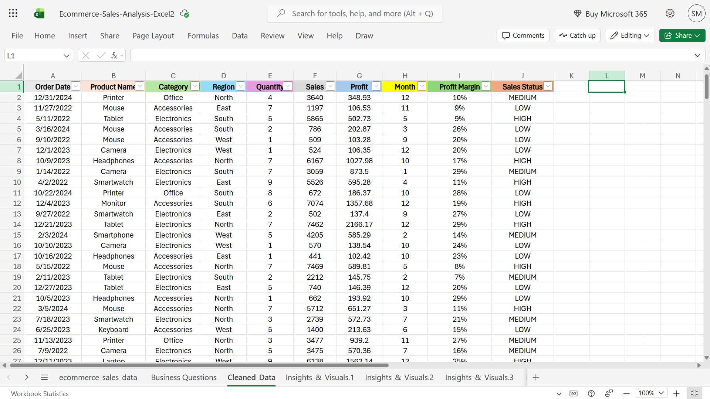
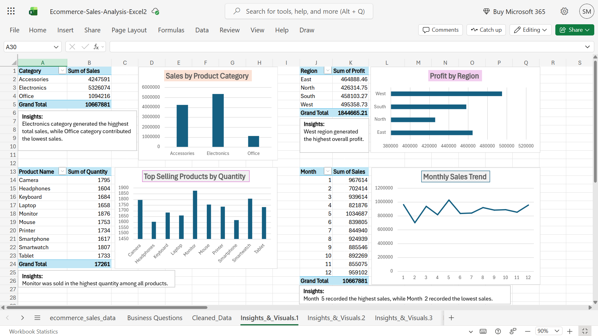
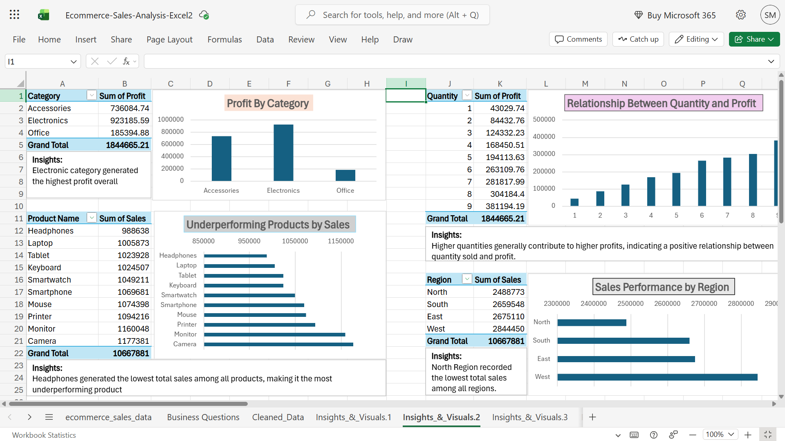
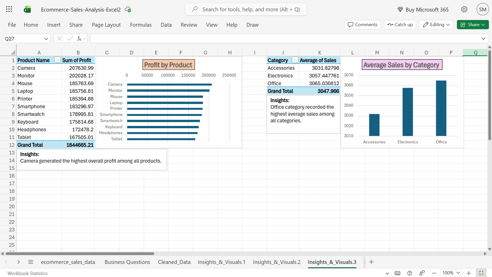
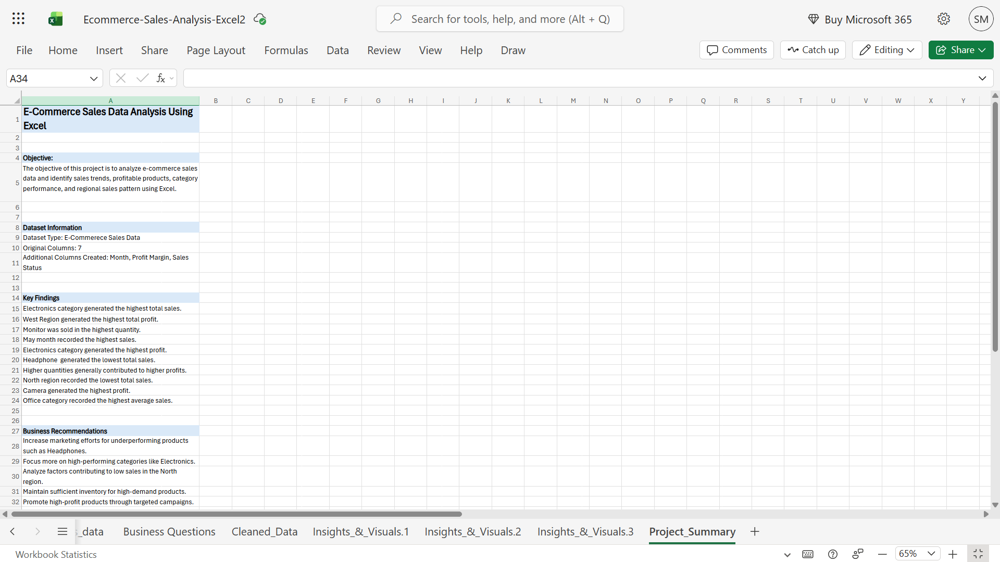

# E-Commerce Sales Data Analysis Using Excel

## Project Overview
This project analyzes e-commerce sales data using Microsoft Excel. The goal was to identify sales trends, profitable products, category performance, and regional sales patterns through data cleaning, pivot tables, charts, and business insights.

---

## Dataset Information

- Dataset Type: E-Commerce Sales Data
- Original Columns: 7
- Additional Columns Created:
  - Month
  - Profit Margin
  - Sales Status

---

## Business Questions Answered

1. Which product category generated the highest sales?
2. Which region contributed the most profit?
3. Which products were sold the most in terms of quantity?
4. What is the monthly sales trend?
5. Which category is the most profitable?
6. Which products are underperforming in sales?
7. Is there a relationship between quantity sold and profit?
8. Which region has the lowest sales performance?
9. Which product generated the highest profit?
10. Which category has the highest average sales?

---

## Key Findings

- Electronics category generated the highest sales.
- West region generated the highest profit.
- Monitor was sold in the highest quantity.
- Month 5 recorded the highest sales.
- Electronics category generated the highest profit.
- Headphones generated the lowest sales.
- Higher quantities generally contributed to higher profits.
- North region recorded the lowest sales.
- Camera generated the highest profit.
- Office category recorded the highest average sales.

---

## Skills Used

- Data Cleaning
- Excel Formulas
- Pivot Tables
- Pivot Charts
- Data Analysis
- Business Insights
- Data Visualization

---

## Tools Used

- Microsoft Excel
- GitHub

## Project Screenshots

### Cleaned Data

### Dashboard 1

### Dashboard 2

### Dashboard 3

### Project Summary

